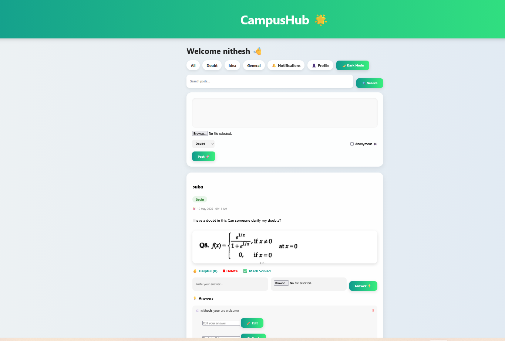
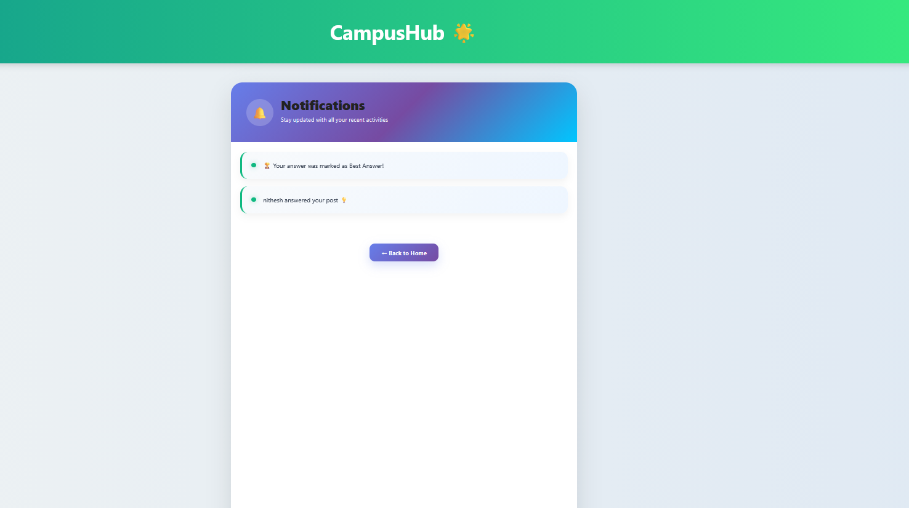

# 🌟 CampusHub – Student Collaboration Platform

CampusHub is a full-stack web application designed to help students collaborate, ask academic doubts, share ideas, and receive answers from peers. It is inspired by platforms like Stack Overflow, Quora, and Reddit, but focused specifically on campus communities.

🔗 **Live Demo:** https://campushub-bv7l.onrender.com  
💻 **GitHub Repository:** https://github.com/Suba-2010/CampusHub

---

## 🚀 Features

### 👤 User Authentication
- User Registration and Login
- Secure session-based authentication

### 📝 Posting System
- Create posts in categories:
  - Doubt
  - Idea
  - General
- Upload images with posts
- Anonymous posting option

### 💬 Discussion Features
- Answer questions with text and images
- Reply to answers
- Edit answers
- Delete posts and answers
- Best Answer selection

### 👍 Engagement Features
- Helpful votes
- Save posts
- Solved badge
- Notifications

### 👤 User Profile
- Upload profile picture
- View statistics:
  - Total Posts
  - Total Answers
  - Helpful Votes

### 🔍 Search & Filter
- Search posts by keywords
- Filter by category

### 🎨 UI Features
- Modern responsive design
- Dark Mode
- Professional cards and badges

### ☁️ Deployment
- Hosted on Render
- Source code managed with GitHub

---

## 🛠️ Technologies Used

### Backend
- Python
- Flask
- SQLite

### Frontend
- HTML5
- CSS3
- JavaScript

### Deployment Tools
- Git
- GitHub
- Render

---

## 📁 Project Structure

```text
CampusHub/
│── app.py
│── requirements.txt
│── Procfile
│── database.db
│
├── templates/
│   ├── login.html
│   ├── register.html
│   ├── index.html
│   ├── profile.html
│   └── notifications.html
│
├── static/
│   ├── style.css
│   ├── script.js
│   └── uploads/
│
└── README.md
```

---

## ⚙️ Installation

### 1. Clone the Repository

```bash
git clone https://github.com/Suba-2010/CampusHub.git
cd CampusHub
```

### 2. Create Virtual Environment

```bash
python -m venv venv
```

### 3. Activate Virtual Environment

#### Windows

```bash
venv\Scripts\activate
```

#### macOS/Linux

```bash
source venv/bin/activate
```

### 4. Install Dependencies

```bash
pip install -r requirements.txt
```

### 5. Run the Application

```bash
python app.py
```

### 6. Open in Browser

```text
http://127.0.0.1:5000
```

---

## 🌐 Deployment

The project is deployed using Render.

🔗 https://campushub-bv7l.onrender.com

---

## 📸 Screenshots

### 🔐 Login Page


### 🏠 Home Feed


### 👤 Profile Page


### 🔔 Notifications


## 📈 Future Enhancements

- AI-powered doubt explanations
- Email verification
- Password reset
- Mobile application using Flutter
- Admin dashboard
- Leaderboard and badges
- Real-time chat

---

## 💼 Resume Description

CampusHub is a full-stack student discussion platform developed using Python, Flask, HTML, CSS, JavaScript, and SQLite. The application enables students to post doubts, upload images, answer questions, vote on helpful responses, receive notifications, and manage personal profiles. The project is deployed on Render and source code is maintained on GitHub.

---

## 👩‍💻 Author

**Subashinee N (Suba)**

- GitHub: https://github.com/Suba-2010
- Live Project: https://campushub-bv7l.onrender.com

---

## 📄 License

This project is developed for educational and internship purposes.

---

## ⭐ Acknowledgements

- CodeAlpha Internship
- Flask Documentation
- Render Hosting
- GitHub
- Stack Overflow inspiration

---

⭐ If you like this project, consider giving it a star on GitHub!
