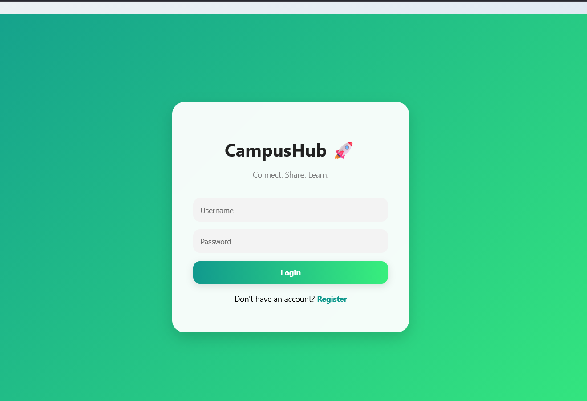
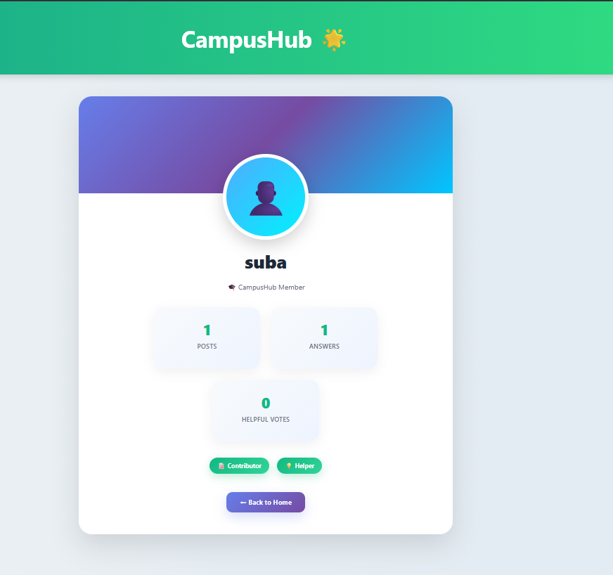

# 🚀 TaskFlow – Collaborative Project Management System

TaskFlow is a web-based collaborative project management system developed using Flask and SQLite. It allows managers and staff members to create projects, assign tasks, communicate through team chat, and monitor project progress efficiently.

---

## 🌐 Live Demo

https://taskflow-qe1m.onrender.com

---

## 🔗 GitHub Repository

https://github.com/Suba-2010/taskflow

---

## ✨ Features

### 👤 User Authentication
- User Registration and Login
- Secure Session Management
- Role-Based Access (Manager / Staff)

### 📁 Project Management
- Create and Delete Projects
- View Assigned Projects
- Invite Team Members to Projects

### 📋 Task Management
- Create Tasks
- Assign Tasks to Team Members
- Update Task Status (To Do / In Progress / Done)
- Edit and Delete Tasks

### 📊 Progress Tracking
- Automatic Progress Bar
- Task Completion Statistics

### 💬 Team Chat
- Project-Specific Chat Room
- Send Messages
- Delete Messages
- Emoji Reactions

### 🔔 Notifications
- Project Invitations
- Task Updates

### 👤 Profile Page
- View User Information
- Display User Role

### 🌙 Dark / Light Mode
- Toggle Theme Across All Pages

### 📈 Dashboard Statistics
- Total Projects
- Total Tasks
- Completed Tasks
- Team Members

---

## 🛠️ Technologies Used

- Python
- Flask
- SQLite
- HTML5
- CSS3
- JavaScript
- Gunicorn
- Render
- Git & GitHub

---

## 📂 Project Structure

taskflow/
│── app.py
│── database.db
│── requirements.txt
│── Procfile
│── .gitignore
│── README.md
│
├── templates/
│   ├── login.html
│   ├── register.html
│   ├── dashboard.html
│   ├── project.html
│   ├── profile.html
│   └── notifications.html
│
├── static/
│   ├── styles.css
│   └── script.js
│
└── screenshots/
    ├── login.png
    ├── dashboard.png
    ├── project.png
    ├── profile.png
    └── notify.png

---

## 📸 Screenshots

### 🔐 Login Page

### 📊 Dashboard

### 📁 Project Page

### 👤 Profile Page

### 🔔 Notifications

---

## ⚙️ Installation

### 1. Clone the Repository
git clone https://github.com/Suba-2010/taskflow.git
cd taskflow
### 2. Create Virtual Environment
python -m venv venv
### 3. Activate Virtual Environment 
## Windows
venv\Scripts\activate
## macOS/Linux
source venv/bin/activate
### 4. Install Dependencies
pip install -r requirements.txt
### 5. Run the Application
python app.py
### 6. Open in Browser

http://127.0.0.1:5000

🚀 Deployment

This application is deployed on Render using:

Build Command
pip install -r requirements.txt
Start Command
gunicorn app:app
👥 User Roles
👑 Manager
Create Projects
Invite Team Members
Assign Tasks
Monitor Progress
Use Team Chat
👨‍💻 Staff
View Assigned Projects
Update Task Status
Participate in Team Chat
📝 Resume Description

TaskFlow is a full-stack collaborative project management system built with Flask and SQLite. It supports role-based authentication, project creation, task assignment, team chat, notifications, and progress tracking. The application is deployed on Render and source code is managed using Git and GitHub.

👩‍💻 Author

Subashinee N (Suba)
B.Sc. Computer Science Student

📜 License

This project is developed for educational and internship purposes.
